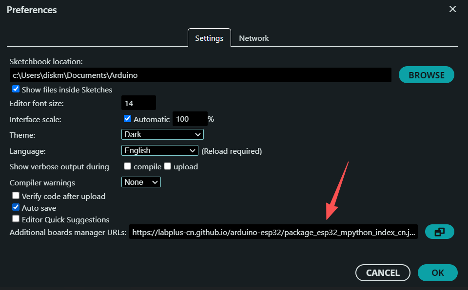
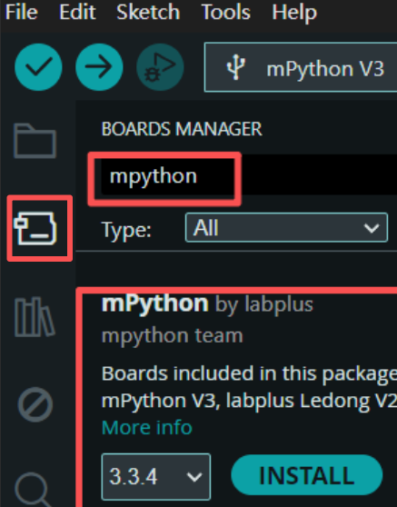
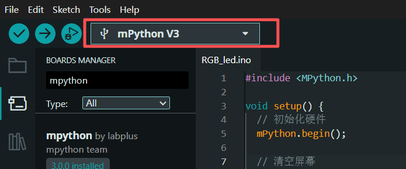

# Arduino 开发环境搭建及库安装

本文档介绍如何搭建 Arduino 开发环境并安装 DFRobot_Mindplus_MPython 库。

## 1. 开发环境搭建

### 1.1 下载安装包

访问 [Arduino官网下载页](https://www.arduino.cc/en/software)，根据你的系统选择对应版本的Arduino IDE下载并安装：

### 1.2 添加掌控板支持

1. 打开Arduino IDE，点击「File」→「Preferences」
2. 在「Additional boards manager URLs」中填入[掌控板开发支持URL](https://raw.githubusercontent.com/labplus-cn/arduino-esp32/refs/heads/gh-pages/package_esp32_mpython_index_cn.json)
   
3. 点击「OK」保存



## 2. 库安装

### 2.1 通过 Arduino IDE 库管理器安装

1. 打开 Arduino IDE，点击「Sketch」→「Include Library」→「Manage Libraries...」
2. 在搜索框中输入「mpython」
3. 找到库后，点击「Install」按钮进行安装
4. 等待安装完成，即可在项目中使用该库



### 2.2 选择掌控板开发板

在IDE界面选择掌控板开发板：



## 3. 验证安装

1. 打开 Arduino IDE，创建一个新的项目
2. 在代码编辑器中输入以下代码：

```cpp
#include <MPython.h>

void setup() {
  // 初始化硬件
  mPython.begin();
  
  // 清空屏幕
  mPython.display.fillScreen(0x0000);
  mPython.display.drawText(20, 10, "Hello, mPython!", 0xFFFF);
  mPython.display.show();
  
  // 点亮 RGB LED
  mPython.rgb.begin();
  mPython.rgb.write(0, 255, 0, 0);
  
  // 蜂鸣器发声
  mPython.buzz.begin();
  mPython.buzz.freq(1000);
  delay(1000);
  mPython.buzz.off();
}

void loop() {
  // 读取按钮状态
  if (mPython.buttonA.isPressed()) {
    mPython.display.drawText(20, 30, "Button A pressed!", 0x00FF00);
    mPython.display.show();
  }
  delay(100);
}
```

3. 选择正确的开发板和串口
4. 点击「Upload」按钮上传代码
5. 观察掌控板的反应：
   - 屏幕显示 "Hello, mPython!"
   - RGB LED 点亮红色
   - 蜂鸣器发出一声蜂鸣
   - 按下按钮A时，屏幕显示 "Button A pressed!"

如果以上步骤都能正常完成，说明开发环境搭建和库安装成功。

## 4. 常见问题解决

### 4.1 无法找到掌控板开发板

- 检查「Additional boards manager URLs」是否正确设置
- 确保已安装mPython掌控板支持包
- 重启Arduino IDE后再次尝试

### 4.2 无法上传代码

- 检查USB驱动是否正确安装
- 确认选择了正确的串口
- 尝试更换USB线缆或USB端口
- 确保掌控板处于正常工作状态

### 4.3 库文件缺失或编译错误

- 检查库是否正确安装
- 确认代码中包含了正确的头文件 `#include <MPython.h>`
- 尝试重新安装库文件

## 5. 参考资源

- [Arduino官网](https://www.arduino.cc/)
- [掌控板3.0文档](https://mpython-esp32s3-doc.readthedocs.io/zh-cn/latest/)
- [DFRobot官方网站](https://www.dfrobot.com/)