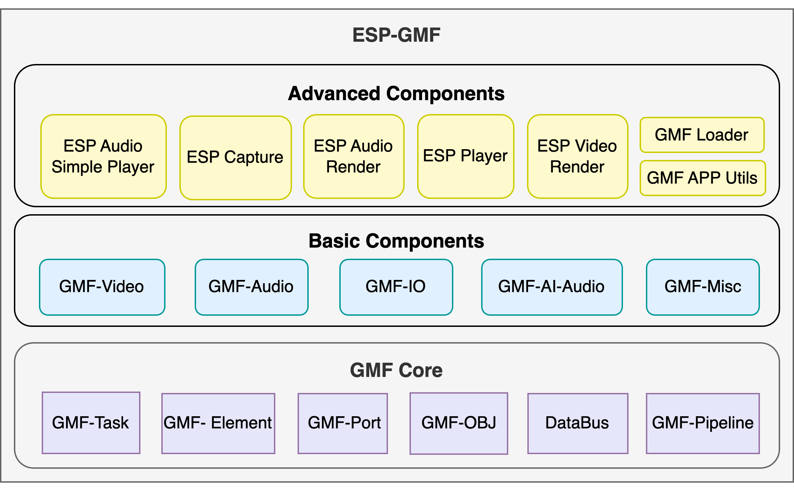

# ESP-GMF

- [中文版](./README_CN.md)

The Espressif General Multimedia Framework (ESP-GMF) is a lightweight and versatile software framework developed by Espressif specifically for IoT multimedia applications. It is highly flexible and scalable and tailored for IoT chips, with RAM usage as low as 7 KB. ESP-GMF supports applications in audio, image, and video processing, as well as any data-streaming product.

ESP-GMF consists of four modules: GMF-Core, Elements, Packages, and GMF-Examples.

- **GMF-Core** is the core of the ESP-GMF software framework and includes the main components such as GMF-Element, GMF-Pipeline, and GMF-Task.
- **Elements** implements various functional elements based on GMF-Core, such as codec algorithms, audio processing algorithms, and more.
- **Packages** implements high-level functional components based on GMF-Pipeline, such as the **ESP Audio Simple Player**, which is a basic audio decoding player.
- **GMF-Examples** provides examples of how to use GMF-Pipeline to implement simple functionalities, such as playing music from flash or an SD card.

# ESP-GMF Component Overview

ESP-GMF modules exist as components, which are categorized by functionality into **atomic components**, **basic components** and **advanced components**. When developing a project, it is recommended to use the elements and IOs components from the official repository. You can also create your own elements and IO components to extend its application scenarios.

## GMF Core component

The GMF core component is the essential foundation of ESP-GMF. It provides the underlying infrastructure such as pipeline management, task scheduling, and data flow control. Most users will not need to interact with this component directly, as it is abstracted by higher-level components. However, it is essential for developers who want to extend the framework or create custom elements.

| Component Name | Function | Example | Dependent Components |
| :------------: | :------------: | :------------ | :------------ |
| [gmf_core](./gmf_core) | Core framework for GMF | [test_apps](./gmf_core/test_apps) | None |

## Basic Components

Basic components are intermediate-layer modules in ESP-GMF that handle data processing and core capabilities like audio/video stream encoding/decoding. These components have clear input/output interfaces, focus on specific tasks, and are reusable and composable. They can be used independently or commonly combined to build complex applications.

**Recommended for**: Developers who need maximum flexibility and fine-grained control over multimedia pipelines. Suitable for building custom processing chains, implementing specialized audio/video effects, or creating unique application logic. Requires a solid understanding of pipeline concepts and component interactions.

| Component Name | Function | Example | Dependent Components |
| :------------: | :------------: | :------------ | :------------ |
| [gmf_audio](./elements/gmf_audio) | Elements for audio encoding, decoding, and sound effects processing | [test_apps](./elements/test_apps) | - `gmf_core` - `esp_audio_effects` - `esp_audio_codec` |
| [gmf_misc](./elements/gmf_misc) | Utility elements | [test_apps](./elements/test_apps) | None |
| [gmf_io](./elements/gmf_io) | Input/output for files, flash, and HTTP | [test_apps](./elements/test_apps) | - `gmf_core` - `esp_codec_dev` |
| [gmf_ai_audio](./elements/gmf_ai_audio) | Elements for intelligence audio processing and speech recognition | [examples](./elements/gmf_ai_audio/examples) | - `esp-sr` - `gmf_core` |
| [gmf_video](./elements/gmf_video) | Elements for video encoding, decoding, and video effects processing | [test_apps](./elements/test_apps) | - `gmf_core` - `esp_video_codec` |

## Advanced Components

Advanced components are encapsulation modules in ESP-GMF that target specific application scenarios, typically composed of multiple basic components or even atomic components. They encapsulate common multimedia business processes, hide the underlying pipeline construction and component configuration logic, provide simple and easy-to-use interfaces to help users quickly implement complex functions, simplify user development processes, and facilitate rapid integration. This category also includes utility modules and example collections.

**Recommended for**: Most users. These components provide ready-to-use solutions for common multimedia tasks, from simple audio playback (`esp_audio_simple_player`) to advanced features like audio/video seek, mixing, and rendering (`esp_player`, `esp_audio_render`, `esp_capture`). They significantly reduce development time and complexity while still offering customization options.

| Component Name | Function | Example | Dependent Components |
| :------------: | :------------: | :------------ | :------------ |
| [esp_audio_simple_player](./packages/esp_audio_simple_player) | Simple audio player | [test_apps](./packages/esp_audio_simple_player/test_apps) | - `gmf_audio` - `gmf_io` |
| [gmf_loader](./packages/gmf_loader) | Set up the given GMF pool using the   configuration selected via `Kconfig` | [test_apps](./packages/gmf_loader/test_apps) | - `gmf_core` - `gmf_io` - `gmf_audio` - `gmf_misc` - `gmf_video` - `gmf_ai_audio` - `esp_codec_dev` - `esp_audio_codec` - `esp_video_codec` |
| [gmf_app_utils](./packages/gmf_app_utils) | Common peripheral configuration, unit  testing tools Memory leak detection tools | [test_apps](./packages/gmf_app_utils/test_apps) | - `gmf_core` - `protocol_examples_common` - `esp_board_manager`|
| [esp_capture](./packages/esp_capture) | High-level multimedia capture module | [examples](./packages/esp_capture/examples) | - `gmf_core` - `gmf-audio` - `gmf-video` - `esp_muxer` - `esp_codec_dev` - `esp-sr` - `esp_video` - `esp32-camera`|
| [esp_board_manager](./packages/esp_board_manager) | Intelligent, automated board configuration and management utilities with YAML-based setup | [test_apps](./packages/esp_board_manager/test_apps) | Dependencies vary based on selected board |
| [esp_audio_render](./packages/esp_audio_render) | Audio render module with mixer support | [examples](./packages/esp_audio_render/examples) | - `gmf_core` - `gmf-audio` |

# ESP-GMF Usage Guide

For usage examples, please refer to the `examples` or `test_apps` directory of each component listed above.

# Frequently Asked Questions

- **What is the difference between ESP-GMF and ESP-ADF?**

   ESP-ADF is a functional repository that includes many modules, such as `audio_pipeline`, `services`, `peripherals`, and `audio boards`. It is commonly used for more complex projects. ESP-GMF is an extension of the `audio_pipeline` module, designed to support applications for streaming audio, video, and image data. ESP-GMF offers a more modular structure than ESP-ADF's `audio_pipeline` by organizing functionality into different components, making it more flexible. For example, it is suitable for simple data streaming, such as playing audio from SD card/flash, or combining multiple components to provide more complex modules (e.g., audio player `esp_audio_simple_player`). Future versions of ESP-ADF will replace the `audio_pipeline` module with ESP-GMF.
