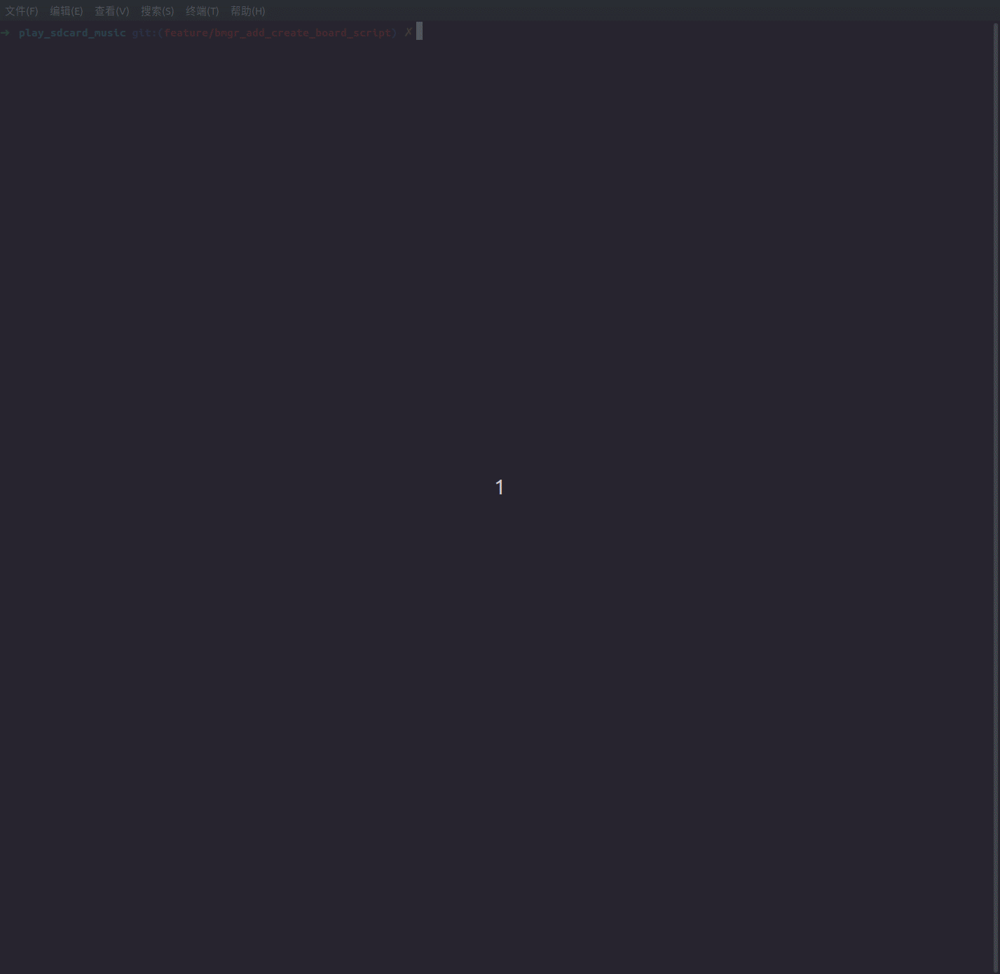

# How to Customize Board

## Supported Board Paths

ESP Board Manager allows modular board customization, supporting the following three different paths for placing board configuration, providing flexibility for different deployment scenarios:

1. **Main Board Directory**: Built-in boards provided with the component, path like `esp_board_manager/boards`
2. **User Project Components**: Custom boards defined in project components, path like `{PROJECT_ROOT}/components/board_name`, refer to: [`esp_board_manager/test_apps/components/test_board_e/`](../test_apps/components/test_board_e/)
3. **Custom Path**: External board definitions in custom locations, such as [`esp_board_manager/test_apps/test_single_board`](../test_apps/test_single_board/), when running commands you need to specify the path via the `-c` parameter to set custom path `idf.py gen-bmgr-config -c test_single_board -l`

> **Note:** If you use the ESP Board Manager component automatically downloaded from the component repository, it is not recommended to directly create custom boards in the motherboard-level directory to avoid accidentally deleting custom board configurations when cleaning components

## Creating a New Board

### 1. **Create Board Directory**

- It is recommended to place the board directory under the project's components folder `{PROJECT_ROOT}/components/XXXX`,

   ```bash
   mkdir components/<board_name>
   cd components/<board_name>
   ```

### 2. **Create Required Files**

There are three ways to create a new board:

#### 2.1 **Modify Based on Existing Configuration**

- Copy a similar board file from the motherboard-level directory to the project directory, and then **modify it according to the actual board being used** (recommended). You can then validate the new board by referring to [Validating and Using the New Board](#validating-and-using-the-new-board).

#### 2.2 **Use Script to Create**

- Use the script provided by ESP Board Manager to automatically create the board. The script will **automatically search and copy** required configurations based on the selected peripherals and devices, saving you the step of manually copying configuration information from corresponding folders. Usage is as follows:

```bash
# Create the board configuration files at the default path (default path is {PROJECT_ROOT}/components/<board_name>):
idf.py gen-bmgr-config -n <board_name>

# Create the board configuration files at a custom path:
idf.py gen-bmgr-config -n path/to/board/<board_name>
```

After running the script, you need to sequentially select **chip, device, and peripherals** according to the prompts. The script will automatically check the dependencies of devices on peripherals. If any peripheral is missing, the script will prompt you to add it until all dependencies are satisfied.

> **Note:**
> - Before proceeding with further operations, you need to manually **review and modify the `board_devices.yaml` and `board_peripherals.yaml` configuration files to meet the actual requirements of the board**, paying special attention to configuration items with `[IO]` and `[TO_BE_CONFIRMED]` keywords.
> - Please check the names of devices and peripherals to ensure there are no duplicate names for devices or peripherals.
> - Only devices and peripherals supported by the chip will appear in the script's options.
> - **Important: Devices find dependent peripherals by name**. Please ensure that all peripherals required by the devices are added to `board_peripherals.yaml`, and that the peripheral `name` filled in the device configuration in `board_devices.yaml` exactly matches the corresponding `name` in `board_peripherals.yaml`, and peripheral names **must start with the type**
>
> For example:
> ```yaml
> # board_devices.yaml
>  - name: led_green
>    type: gpio_ctrl
>    config:
>      ...
>    peripherals:
>      - name: gpio_led_g
>
> # board_peripherals.yaml
>  - name: gpio_led_g
>    type: gpio
>    config:
>      ...
> ```

**Usage demonstration**


#### 2.3 **Manually Create Files**

- Run the following script to manually create the required files for the board.

   ```bash
   touch board_peripherals.yaml
   touch board_devices.yaml
   touch board_info.yaml
   touch Kconfig
   touch sdkconfig.defaults.board  # Optional: board-specific SDK configuration defaults
   ```

> **Note:**
> All methods rely on proper configuration in the device and peripheral YAML files. These YAML files closely mirror the original driver parameters, including:
>
> - Which configuration fields are supported
> - Valid enum values
> - Allowed parameter ranges
>
> In other words, the YAML configuration is designed to match the underlying driver API as closely as possible, so existing driver knowledge can be reused.
>
> For the exact definitions and supported options, refer to:
>
> - `esp_board_manager/devices/xxx/xxx.yaml`
> - `esp_board_manager/peripherals/xxx/xxx.yaml`.

### 3. **Configuration File Structure**

**Kconfig**
   ```kconfig
   config BOARD_<BOARD_NAME>
       bool "<Board Display Name>"
       depends on SOC_<CHIP_TYPE>  # optional
   ```

**Board Information**
   ```yaml
   # board_info.yaml
   board: <board_name>
   chip: <chip_type>
   version: <version>
   description: "<board description>"
   manufacturer: "<manufacturer_name>"
   ```

**Peripherals Configuration**
   - Refer to similar peripheral configuration YAML files in the `boards` directory
   - Configure based on the supported peripheral YAML files under `peripherals`
   The basic structure for each peripheral is as follows:
   ```yaml
   # board_peripherals.yaml
   board: <board_name>
   chip: <chip_type>
   version: <version>

   peripherals:
     - name: <peripheral_name>
       type: <peripheral_type>
       role: <peripheral_role>
       config:
         # Peripheral-specific configuration
   ```

**Devices Configuration**
   - Refer to similar device configuration YAML files in the `boards` directory
   - Configure based on the supported device YAML files under `devices`
   The basic structure for each device is as follows:
   ```yaml
   # board_devices.yaml
   board: <board_name>
   chip: <chip_type>
   version: <version>

   devices:
     - name: <device_name>
       type: <device_type>
       sub_type: <sub_type>   # Optional: sub-device type string, each device may have its own sub-type or none
       init_skip: false  # Optional: skip automatic initialization (default: false)
       dependencies:     # Optional, define component dependencies
         espressif/gmf_core:
            version: '*'  # Use version from espressif component registry
            override_path: ${BOARD_PATH}/gmf_core
            # Optional: allows you to use a local component instead of the version downloaded from the component registry.
            # You can specify:
            #   - Absolute path, or
            #   - Relative path under ${BOARD_PATH} for easier management
       config:
         # Device-specific configuration
         sub_config:      # Optional: provide sub-configuration if sub_type exists
         # Sub-type specific configuration
       peripherals:
         - name: <peripheral_name>
   ```

> **⚙️ Notes on Using `dependencies`**
>
> - The `dependencies` field in `board_devices.yaml` allows you to specify component dependencies for each device. This is particularly useful for board levels that require custom or local versions of components.
> - These dependencies will be copied to the `idf_component.yml` file in the `gen_bmgr_codes` folder. If dependencies with the same name exist, only the last one is retained according to YAML order.
> - This field supports all component registry features, including `override_path` and `path` options. For more details, refer to [Component Dependencies](https://docs.espressif.com/projects/idf-component-manager/en/latest/reference/manifest_file.html#component-dependencies).
> - When using relative paths as local paths, note that they are relative to the `gen_bmgr_codes` directory. If the user specifies a local path in the board directory, use `${BOARD_PATH}` to simplify the path. Refer to the example: `./test_apps/test_custom_boards/my_boards/test_board1`.
>
> **⚙️ `${BOARD_PATH}` Variable:**
> - `${BOARD_PATH}` is a special variable that always points to the root directory of the current board definition (i.e., the folder containing your `board_devices.yaml`).
> - When specifying local or board-specific component paths in the `override_path` or `path` fields, always use `${BOARD_PATH}`. For more details, refer to [Local Directory Dependencies](https://docs.espressif.com/projects/idf-component-manager/en/latest/reference/manifest_file.html#local-directory-dependencies).
> - ❌ **Incorrect**: `{{BOARD_PATH}}` or `$BOARD_PATH`

### 4. **Board-Specific SDK Configuration (Optional)**

`sdkconfig.defaults.board` file is used to define board-specific default SDK configuration.

   - Create a `sdkconfig.defaults.board` file in the board directory to define board-specific SDK configuration defaults
   - When switching to this board, the script will automatically **write** these settings to the project's `board_manager.defaults` file
   - This ensures that board-specific configurations are automatically applied via `SDKCONFIG_DEFAULTS` environment variable during ESP-IDF build system operations (menuconfig, reconfigure, etc.)

   Example:
   ```bash
   # sdkconfig.defaults.board
   # Example: board with Octal PSRAM (8-line)
   CONFIG_SPIRAM_MODE_OCT=y
   CONFIG_SPIRAM_SPEED_80M=y
   ```
   - The file supports standard ESP-IDF sdkconfig format:
     - `CONFIG_XXX=y` enable
     - `CONFIG_XXX=n` or `# CONFIG_XXX is not set` disable
     - `CONFIG_XXX="value"` string value
   - When switching boards, the `board_manager.defaults` file is regenerated with new board configurations

   Configuration Priority:
1. `sdkconfig` (user's current configuration)
2. `sdkconfig.defaults` (project defaults)
3. `board_manager.defaults` (board-specific configurations, higher priority than sdkconfig.defaults)
4. Component's own defaults

### 5. **Custom Code in the `board` Directory**

Some devices require board-specific initialization logic that cannot be fully described through YAML configuration alone. Typical examples include `display_lcd`, `lcd_touch`, and so on.

To support flexible board adaptation, the board directory allows you to provide custom implementation code, enabling the board to:

- Execute appropriate initialization routines for devices
- Handle board-specific wiring, timing, or power-up sequences
- Override or extend the default device initialization behavior when necessary

For concrete examples of how this is done, see:
[setup_device.c](esp_board_manager/boards/echoear_core_board_v1_2/setup_device.c), which implements specific initialization flows for display_lcd and lcd_touch devices

## YAML Configuration Rules

For detailed YAML configuration rules and format specifications, please refer to [Device and Peripheral Rules](docs/device_and_peripheral_rules.md).

## Board Selection Priority

When boards with the same name exist in different paths, ESP Board Manager follows a specific priority order to determine which board configuration to use:

**Priority Order (highest to lowest):**

1. **Custom Customer Path** (highest priority)
   - Boards specified via the `-c` parameter
   - Example: `idf.py gen-bmgr-config -b my_board -c /path/to/custom/boards`

2. **User Project Components** (medium priority)
   - Boards in project components: `{PROJECT_ROOT}/components/{component_name}/boards`
   - These override boards with the same name in the main board directory

3. **Main Board Directory** (lowest priority)
   - Built-in boards: `esp_board_manager/boards`
   - Used as a fallback when no other version exists

**Important Notes:**
- **No Duplicate Warning**: The system silently uses the higher-priority board without warning about duplicates

## Custom `custom` Device Explanation

For devices and peripherals not yet included in esp_board_manager, it is recommended to add them via the `custom` type device.

- Place the device's `init` and `deinit` function code in the development board path, and register the device with the board manager using `CUSTOM_DEVICE_IMPLEMENT("device_name", init_func, deinit_func)`.

- Add the configuration for the custom device in the development board path `board_devices.yaml`, where the `type` needs to be configured as `custom`.

- After executing the command `idf.py gen-bmgr-config -b xxx` to generate the development board's configuration code, the `gen_board_device_custom.h` header file will be generated in the `components/gen_bmgr_codes` path for use by the application.

- You can refer to the implementation method in [`m5stack_cores3`](../boards/m5stack_cores3/power_manager.c). M5stack_cores3 defines a power management chip using the custom type and implementing the init and deinit functions.

## Validating and Using the New Board

**Validate Board Configuration**

   ```bash
   # Test whether your board configuration is valid
   # Ensure that IDF_EXTRA_ACTIONS_PATH is set and still valid
   # For main board directory and user project components (default paths)
   idf.py gen-bmgr-config -b <board_name>

   # For custom customer paths (external locations)
   idf.py gen-bmgr-config -b <board_name> -c /path/to/custom/boards

   # Or use the standalone script
   cd $YOUR_ESP_BOARD_MANAGER_PATH
   python gen_bmgr_config_codes.py -b <board_name>
   python gen_bmgr_config_codes.py -b <board_name> -c /path/to/custom/boards
   ```

   **Verify Successful Generation**: If the board configuration is valid, the following files will be generated in the project path:

   - `components/gen_bmgr_codes/gen_board_periph_handles.c` - Peripheral handle definitions
   - `components/gen_bmgr_codes/gen_board_periph_config.c` - Peripheral configuration structures
   - `components/gen_bmgr_codes/gen_board_device_handles.c` - Device handle definitions
   - `components/gen_bmgr_codes/gen_board_device_config.c` - Device configuration structures
   - `components/gen_bmgr_codes/gen_board_info.c` - Board metadata
   - `components/gen_bmgr_codes/CMakeLists.txt` - Build system configuration
   - `components/gen_bmgr_codes/idf_component.yml` - Component dependencies

   **If Errors Occur**: Check your YAML files for syntax errors, missing fields, or invalid configurations.

> **Note**: When you run `idf.py gen-bmgr-config` for the first time, the script will automatically generate the Kconfig menu for the selected board.
